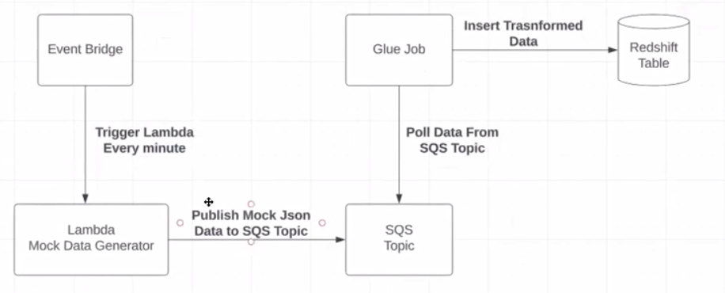

# Data Pipeline to put data in redshift table

## Objective
Prepare data with AWS lambda, send it to SQS topic. Then we created a glue job to get data from SQS and dump it into redshift table.

## Tools Stack

* AWS-lambda
* AWS-SQS
* AWS-glue
* AWS-s3,
* AWS-redshift
* Airflow

## Flow Diagram

